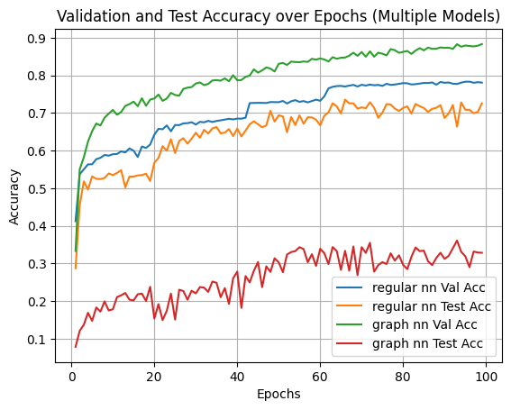

# Follow-up Study on Sign Language Translation

👨‍🎓[Previous work](https://github.com/dancsomarci/sign-language)

## Pillars of Research & Development:

| Status | Meaning                  |
|--------|--------------------------|
| ✅     | Done                     |
| ❌     | Abandoned                |
| 🚧     | Not for now              |
| ❗      | Idea worth exploring     |
| 🕐     | Only if time allows      |

## Research 🧠

- GNN Reserach
    - ✅PyTorch vs ❌Tensorflow (due to better community support)
    - ✅[`pytorch_geomteric` library](https://pytorch-geometric.readthedocs.io/en/latest/)
    - ✅[Intro to GNN in Tensorflow](https://www.youtube.com/watch?v=8owQBFAHw7E&ab_channel=TensorFlow)

    - ✅[GCN](https://www.youtube.com/watch?v=JtDgmmQ60x8&ab_channel=AntonioLonga)
    - ✅[GAT](https://www.youtube.com/watch?v=AWkPjrZshug&ab_channel=MashaanAlshammari)
    - 🚧[Point Cloud Classification](https://colab.research.google.com/drive/1D45E5bUK3gQ40YpZo65ozs7hg5l-eo_U?usp=sharing)
    - 🚧[GRNN](https://www.youtube.com/watch?v=v7TQ2DUoaBY&ab_channel=AntonioLonga)

- Static Fingerspelling
    - ✅Applying GNNs caused a significant bump in validation accuracy, but a decrease in test accuracy
    - Use the fact that each hand-graph is the same:
        - 🚧Special Batched GNN layers
    - ❗Experiment with different setups (combine heads with Linear layer etc...)
    - 🕐Classify hands with missing points (graph vs padding representation) -> MLP vs GNN

    

- Continuous Fingerspelling
    - ✅Revisit Transformers
        - ✅[PyTorch Transformer](https://towardsdatascience.com/build-your-own-transformer-from-scratch-using-pytorch-84c850470dcb)
        - ✅[Illustrated Multi-Head attention](https://jalammar.github.io/illustrated-transformer/)
        - ✅[Positional Encoding](https://machinelearningmastery.com/a-gentle-introduction-to-positional-encoding-in-transformer-models-part-1/)
    - ✅Rebuild Transformer from previous study using `PyTorch`
        - ✅Proper masking for both enc-dec inputs
        - ✅Improved Padding for both inputs
    - ✅Enhanced Data Handling
        - ✅Filter any special characters as this experiment focuses on traditional characters: `a-z` and `numbers`
        - ✅Identify dominant hand (enough for ASL Fingerspelling), `only work with the 21*3 coordinates of dominant hand`
        - ✅Remove frames where the dominant hand is not fully visible
        - ✅Keep sequences that have at least 3 frames/character in the target phrase
        - 🚧More professional data saving (hdf5, parquet)
    - ✅GNN-based embedding
        - ✅Time Series Dataset Handling [for advanced minibatching](https://github.com/pyg-team/pytorch_geometric/blob/master/torch_geometric/loader/dataloader.py)
        - 🚧Faster embedding based on real batching (same size graphs!)
    - Training
        - ✅Train on `seq_len`=128 while optimizing
        - ✅Refactor code
        - ✅Shuffle dataset not only inside batch
        - ✅Prep training loop for valid data
        - ✅Export results with settings
        - ✅GPU ready
        - ✅Kaggle dataset upload
        - Compare different configurations
    - Evaluation
        - Train a fully optimized model on `seq_len`=256
        - ❗Separate train-valid from test based on `signer_ids`
        - ✅`Levenshtein distance` (specially masked)

- Paper
    - Skeleton
    - ❗Real World analysis (at least measure inference time)
    - ❗🕐Use [ChicagoFSWild](https://home.ttic.edu/~klivescu/ChicagoFSWild.htm#overview) dataset
    - ❗Compare Continuous FS With Other Studies
        - [Fingerspelling PoseNet](https://arxiv.org/abs/2311.12128)
    - ❗[image based solution](https://github.com/fmahoudeau/MiCT-RANet-ASL-FingerSpelling)
    - ❗Visualize attention. Intuition suggests, that constant stream -> same token multiple times -> problem (perhaps figure out a way to enhance attention for such cases/research existing solutions)

- ❗❓🕐Cluster Analysis of Embedded Sequences